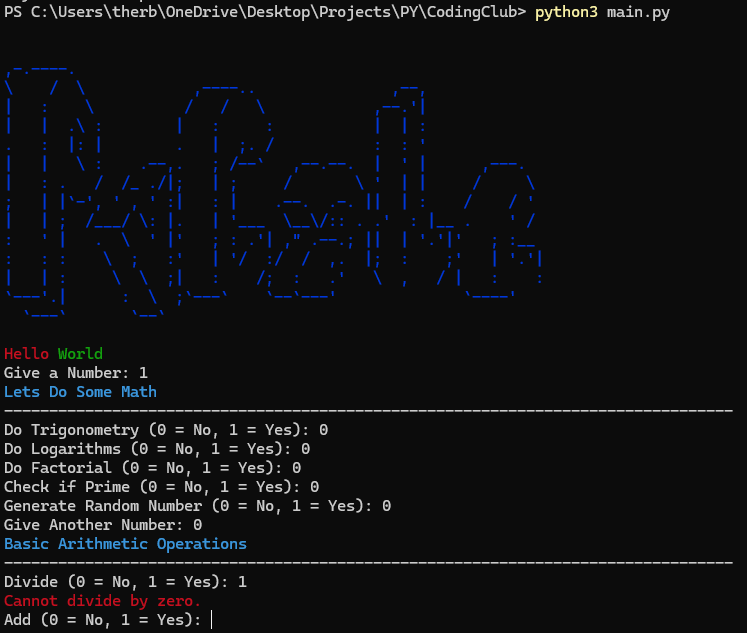

## Why did I make this abomination
Bc Why tf not :}

## Out of Everything Why this?
I was in coding club and got bored :3

## How does it work?
Example:


## Packages Needed
To run this project, you need the following Python packages:

- `termcolor` (for colored terminal output)

To install the package, run:

```sh
pip install -r requirements.txt
```


## Cloning and Running the code

- Clone the Repo
    git clone https://github.com/TwrblxDevs/StupidlyComplexPyCalculator.git

- Navigate to the Project Directory
    cd StupidlyComplexPyCalculator

- Install the Required Packages
    pip install -r requirements.txt

- Run the Script
    python3 main.py